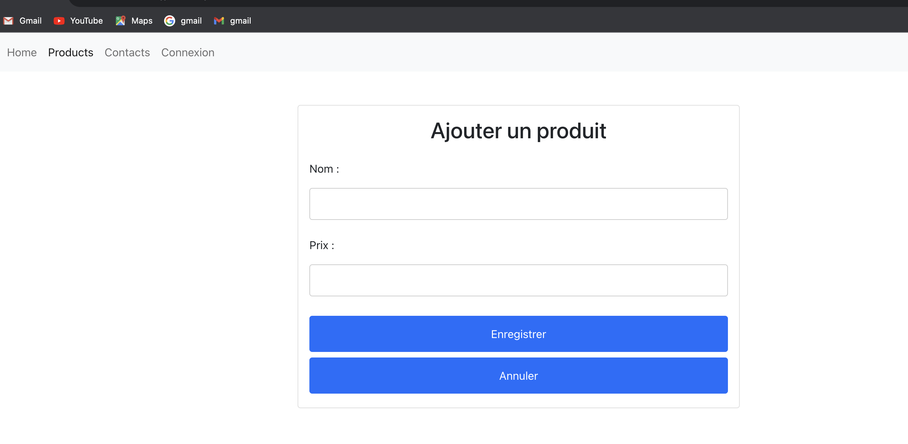
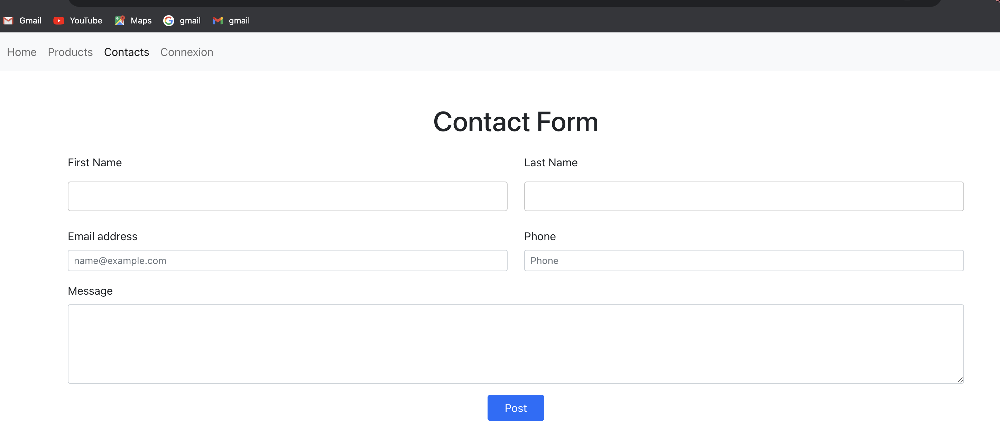
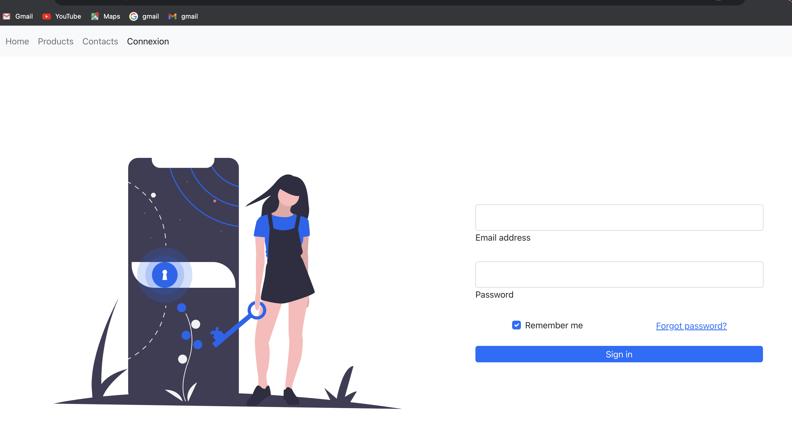
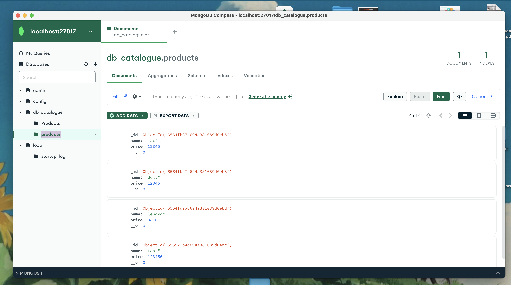

# Description de l'Application :

L'application que nous avons développée est une plateforme de gestion de produits qui offre une interface conviviale pour ajouter, afficher et supprimer des produits. Cette application est conçue pour simplifier la gestion des produits, offrant aux utilisateurs un moyen efficace de gérer leur inventaire.

## Fonctionnalités Principales :
- Liste des Produits : La page principale de l'application présente une liste complète des produits actuellement enregistrés. Chaque élément de la liste affiche des détails tels que le nom et le prix du produit.

- Ajout de Produits : Les utilisateurs peuvent facilement ajouter de nouveaux produits en fournissant des informations telles que le nom et le prix.

- Suppression : Les utilisateurs ont la possibilité de supprimer des produits existants.

## Interface Utilisateur Intuitive :

L'interface utilisateur est conçue de manière à être simple et intuitive. Les formulaires de saisie sont clairs, les boutons sont positionnés de manière logique, et la navigation entre les différentes sections de l'application est fluide.
- page de contact:

- page de connexion:

Et nous avons utilisé MongoDB comme base de données. Axios a été utilisé pour la gestion des requêtes HTTP entre le front-end et le back-end.

